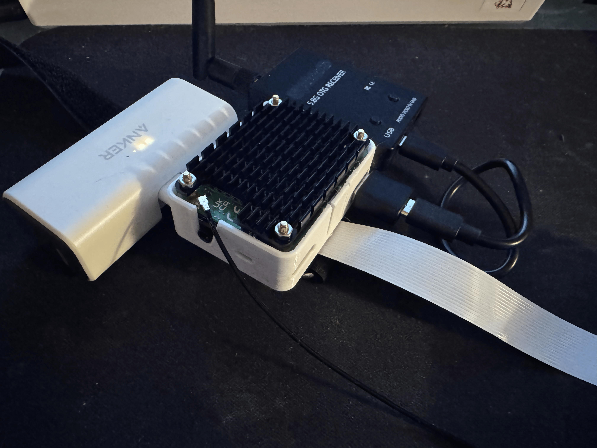

# Wrist Mounted CM4 Multitool Touchinput

# Description
This project is FPV drone focused but can it be easly adapted to other purposes. The Python scripts create a functional touch ui for Raspberry Pi OS Lite. Touch ui wrappers enable apps like mpv and uxplay to start and stop with touch inputs.

# Getting Started
  1. Install Pi OS Lite on the CM4
  2. Edit / replace the contents of config.txt (nano /boot/firmware/config.txt)
  3. Install requirements and dependencies (mpv, uxplay, ffplay)
  4. Run touch_ui.py with sudo

# Hardware Requirements
  1. [Raspberry Pi Compute Module 4](https://www.raspberrypi.com/products/compute-module-4/?variant=raspberry-pi-cm4001000)
  2. [Waveshare - Nano Base Board (B) For Raspberry Pi Compute Module 4](https://www.waveshare.com/cm4-nano-b.htm)
  3. [Waveshare - 4.3" Capacitive Touch Display for Raspberry Pi, DSI Interface, 800x480](https://www.waveshare.com/4.3inch-dsi-lcd.htm)
  4. [Aluminum Heatsink for Raspberry Pi Compute Module 4](https://www.amazon.com/waveshare-Raspberry-Corrosion-Oxidation-Dissipation/dp/B09NVP9C9B?th=1)
  5. [FPV Receiver, 5.8G 150CH OTG FPV Receiver UVC](https://www.aliexpress.us/w/wholesale-5.8g-otg-uvc-receiver.html?g=y&SearchText=5.8g+otg+uvc+receiver&sortType=total_tranpro_desc)
  6. [Anker Nano Power Bank - 22.5W, Built-In USB-C Connector](https://www.anker.com/products/a1653-usb-c-portable-charger-5000mah?variant=42733234258070&utm_source=google&utm_medium=pmax&utm_content=alwayson&utm_campaign=us_security_DIFMSecurity_m1-2_google-pmax_E9000122_purchase_buycode_audience_external&utm_term=22535900822___hotdeal-travel-S2&gad_source=1&gad_campaignid=22529554545&gbraid=0AAAAADbnO27_Bf6lJFIBeAjxoeXOCy24y&gclid=Cj0KCQjw0NPGBhCDARIsAGAzpp1micEtmObNUNghM_m7Dq4vSeVrheTNlQYINO7vkE2KpF8egbi8UaYaAib4EALw_wcB)

# 3D Printables & Wearables
  1. [Raspberry Pi CM4 - Waveshare Nano B Case](https://www.thingiverse.com/thing:5674392/remixes)
  2. [Waveshare 4.3" DSI Display Case](https://www.printables.com/model/991719-waveshare-43-ips-dsi-display-for-raspberry-pi-wall/related)
  3. [Hook and Loop Velco Straps](https://www.amazon.com/s?k=hook+and+loop+velcro+straps&hvadid=410018013276&hvdev=c&hvexpln=0&hvlocphy=9031950&hvnetw=g&hvocijid=10011290035064895997--&hvqmt=e&hvrand=10011290035064895997&hvtargid=kwd-13579558125&hydadcr=18918_11286156&mcid=9676c737b2d834a7b67f33265bb4a5ae&tag=googhydr-20&ref=pd_sl_5y1iwb3osv_e)
  4. [Bluetooth Keyboard](https://www.adafruit.com/product/3601?gad_source=1&gad_campaignid=21079227318&gbraid=0AAAAADx9JvTGcgnCEJUa8A5kDV-I-Guo-&gclid=Cj0KCQjw0NPGBhCDARIsAGAzpp2jjx6QkyOSyLixy9Kwr0u1OxjeN5MNad0XjRfW134NHDoAxfe3-nYaAvT1EALw_wcB)

# Roadmap

| Feature                              | Status       |
|--------------------------------------|--------------|
| ASCII Touch UI                       | Functional   |
| Test Wrappers                        | Functional   |
| 5.8G Video Wrapper                   | Functional   |
| Case Redesign                        | Inprogress   |
| Setup Script                         | Inprogress   |
| UI Imrpovement                       | Inprogress   |
| Integrate Real Time Done Controller  | Inprogress   |
| Integrate ELRS Module                | Inprogress   |

# AI Integration
  The AI integration plan is to implement a [Coral USB Accelerator](https://coral.ai/products/accelerator) to process image classification, this will help create data and pipelines for future features.

# Payload Development
  I am currently using a BetaFPV Meteor 75 Pro to test receiving video streams. Although this is a lightweight drone there is some overhead potentially allowing for a small sensor payload. This payload could enable greater telemetry which could be processed by the CM4 into drone commands.

# Images

